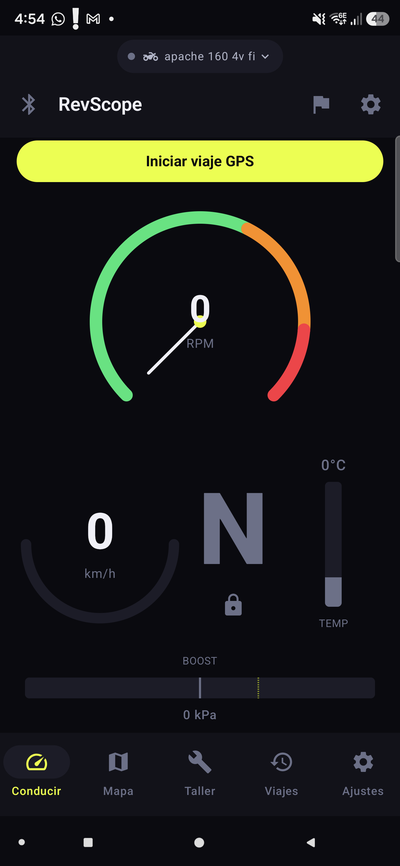
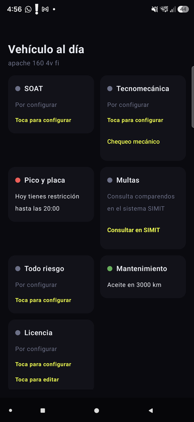
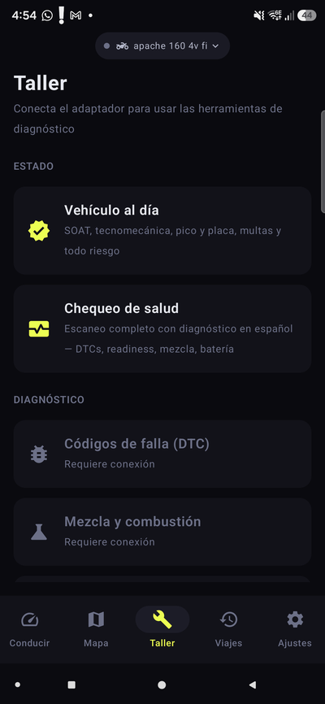
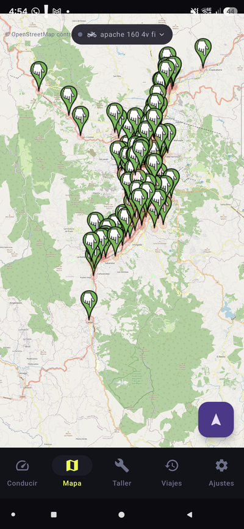
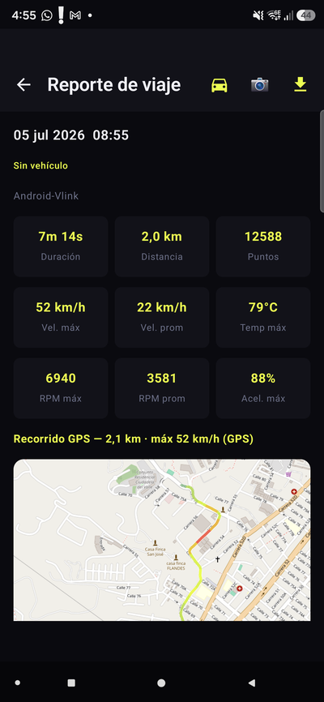
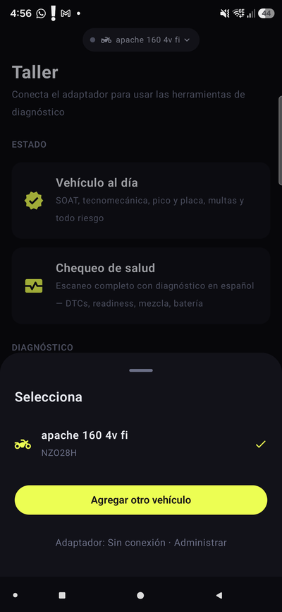

# 🏍 RevScope

**Convierte tu celular en el computador de tu moto o carro.**

Telemetría en vivo, diagnóstico de taller, documentos al día, alertas por voz y hasta un mecánico con IA — todo con un adaptador OBD2 económico (o solo con el GPS del celular).

> *English: RevScope is a free, open-source OBD2 telemetry & workshop suite for Android. Dev docs in [docs/desarrollo.md](docs/desarrollo.md).*

[📥 Descargar APK](https://github.com/santiquiroz/revscope/releases/latest) · [📲 Instalación](docs/instalacion.md) · [📖 Manual](docs/manual-usuario.md) · [❓ FAQ](docs/faq.md)

---

## Así se ve

| | | |
|:---:|:---:|:---:|
|  |  |  |
| **Conducir** — RPM, velocidad (OBD o GPS), marcha, temperatura y shift light | **Vehículo al día** — SOAT, tecnomecánica, pico y placa HOY, multas y mantenimiento | **Taller** — chequeo de salud, DTC con IA, mezcla, onda O2 y más |
|  |  |  |
| **Mapa** — tu ruta en vivo sobre OpenStreetMap con los radares marcados | **Reportes** — gráficas con ejes reales, eco-score, costo en pesos y export CSV | **Garaje** — varios vehículos, cada uno con su adaptador y su historial |

## 🚀 Empezar en 3 pasos

1. **[Descarga el APK](https://github.com/santiquiroz/revscope/releases/latest)** e instálalo — [guía paso a paso](docs/instalacion.md)
2. **Empareja tu adaptador** OBD2 Bluetooth (ELM327, ej. Vgate iCar Pro — [¿cuál comprar?](docs/faq.md)) y conéctalo desde la app
3. **Crea tu vehículo** cuando la app te pregunte — y a rodar 🏁

> 💡 **¿Sin adaptador?** También sirve: el botón **"Viaje GPS"** graba rutas, velocidad, inclinación y fuerzas G solo con el celular — con radares, avisos de pico y placa y detección de caída incluidos.

## ✨ Todo lo que trae

### 📋 Para el día a día
- **Pico y placa automático** — Medellín y Bogotá integrados (motos exentas en Bogotá); si entras a OTRA ciudad donde hoy tienes restricción, te lo dice por voz. Opcional: tu proveedor de IA investiga la restricción de **cualquier ciudad del mundo** (pico y placa, hoy no circula, rodízio…) y la guarda hasta que venza · [configurar](docs/configuracion.md)
- **Documentos al día** — vencimientos de SOAT, tecnomecánica, todo riesgo y licencia con recordatorios escalonados y notificación diaria a las 5:30am
- **Radares con aviso por voz direccional** — registro oficial ANSV + OpenStreetMap; solo avisa si vas HACIA el radar (no por radio), se re-descarga solo al viajar a otra región, actualización semanal automática, funciona offline
- **Costo de cada viaje en pesos** — con el precio de TU combustible (corriente / extra / diésel)
- **Mantenimiento por kilometraje** — aceite, llantas, kit de arrastre, con el odómetro real del vehículo

### 🔧 Para cuidarlo (Taller)
- **Chequeo de salud de un toque** — DTCs + readiness de tecnomecánica + mezcla + batería, interpretado en español con semáforos y **compartible como imagen**
- **Códigos de falla explicados con IA**, **mezcla y combustión en vivo**, **onda del sensor O2**, **resultados Mode 06** y **escáner Mode 22** para PIDs del fabricante
- **Verificación de kilometraje** — lee el odómetro del computador y avisa si fue alterado
- **Mecánico IA** — chatea con un mecánico que conoce TUS datos reales · [manual](docs/manual-usuario.md)

### 🏁 Para el competitivo
- **0-100 automático por voz**, modo pista con vueltas, inclinación, fuerzas G, círculo de fricción y zonas de frenado
- **Comparador de viajes A/B** y **comparador de velocímetros** (OBD vs GPS — mide el error real de tu tablero)
- **Galaxy Watch** — ritmo cardíaco en tu telemetría · [instalar en el reloj](docs/instalacion.md)

### 🆘 Seguridad
- **Detección de caída** — impacto fuerte + inmovilidad → alarma de 60s → SMS con tu ubicación al contacto de emergencia (apagada por defecto, con botón de prueba sin SMS) · [configurar](docs/configuracion.md)
- **Cierre automático de viaje** — apagas el motor y la app guarda todo y deja de gastar batería, sola

### 🤖 Inteligencia artificial (opcional, con tu propia llave)
- **4 proveedores**: Claude, OpenAI, Gemini o **cualquier servidor compatible** (LM Studio local, DeepSeek, Groq…)
- **Información local en ruta** — "Estás en Guarne: hoy hay festival" (con búsqueda web real)
- **Servidor MCP en red local** — las IAs de tu PC (Claude Desktop…) le preguntan a tu vehículo por WiFi · [guía](docs/configuracion.md)

### 💾 Tus datos son tuyos
- **Todo exportable a CSV** — cada gráfica, cada métrica, cada viaje
- **Copia de seguridad** manual y automática semanal — cámbiate de celular sin perder nada
- **100% local**: sin cuentas, sin nube, sin telemetría de terceros

## 📚 Documentación

| Guía | Qué encuentras |
|---|---|
| [📲 Instalación](docs/instalacion.md) | APK, adaptador, primer arranque, reloj Galaxy Watch y Android Auto |
| [📖 Manual de usuario](docs/manual-usuario.md) | Recorrido completo pestaña por pestaña |
| [⚙️ Configuración](docs/configuracion.md) | Cada ajuste: alertas de voz, IA, MCP, radares, caída, backup, pico y placa |
| [❓ FAQ](docs/faq.md) | Las 20+ preguntas de siempre |
| [👨‍💻 Desarrollo](docs/desarrollo.md) | Arquitectura, compilar, tests y cómo contribuir |

## 🛠 Para desarrolladores (resumen)

Kotlin · Jetpack Compose · Hilt · Room (migraciones reales) · pipeline ELM327 propio (batching CAN, circuit breaker, prioridades de sondeo) · Vico · osmdroid · NanoHTTPD (MCP). Multi-módulo, 400+ tests unitarios. Build y guías de extensión en [docs/desarrollo.md](docs/desarrollo.md).

---

Hecho en Colombia 🇨🇴 con una TVS Apache 160 4V y un Mazda CX-30 — y para el tuyo.

**[⬇️ Descargar la última versión](https://github.com/santiquiroz/revscope/releases/latest)**

